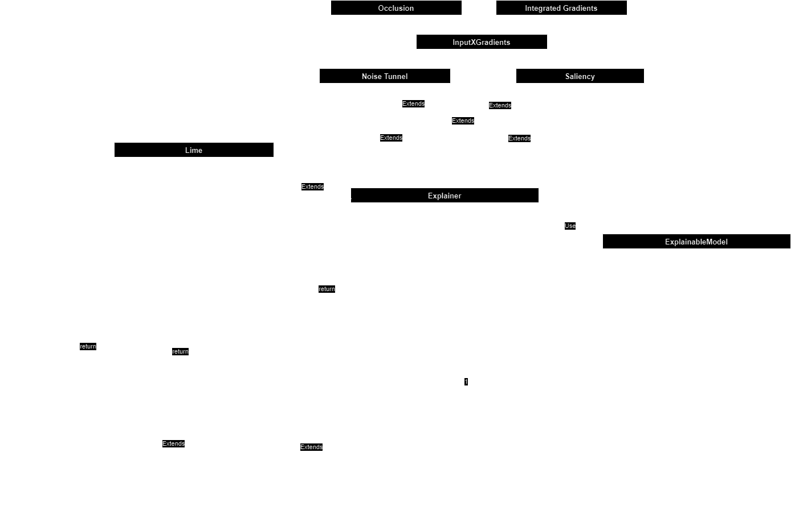

# API Reference

Structure:

- [API Reference](#api-reference)
  - [Meteors](#meteors)
    - [Attribution Methods](#attribution-methods)
      - [Lime](#lime)
      - [Lime Base](#lime-base)
      - [Integrated Gradients](#integrated-gradients)
      - [InputXGradients](#inputxgradients)
      - [Occlusion](#occlusion)
      - [Saliency](#saliency)
      - [Noise Tunnel](#noise-tunnel)
      - [Hyper Noise Tunnel]
    - [Image](#image)

## Meteors

The architecture of the package can be seem on the UML diagram:

### Attribution Methods

::: src.meteors.attr

This module consists of all the attribution methods of the package. It is heavily inspired by the `attr` module of the `captum` package, but is adapted to the multispectral images.

#### Lime

::: src.meteors.attr.lime

An adapted implementation of Lime, which supports handling the multispectral images.

#### Lime Base

The Lime Base class was adapted from the Captum Lime implementation. This adaptation builds upon the original work, extending and customizing it for specific use cases within this project. To see the original implementation, please refer to the [Captum repository](https://captum.ai/api/_modules/captum/attr/_core/lime.html#LimeBase).

#### Integrated Gradients

::: src.meteors.attr.integrated_gradients

#### InputXGradients

::: src.meteors.attr.input_x_gradients

#### Occlusion

::: src.meteors.attr.occlusion

#### Saliency

::: src.meteors.attr.saliency

#### Noise Tunnel

::: src.meteors.attr.noise_tunnel

#### Hyper Noise Tunnel

::: src.meteors.attr.hyper_noise_tunnel

Hyper Noise Tunnel is our novel method, designed specifically to explain hyperspectral satellite images. It is inspired by the behaviour of the classical Noise Tunnel (Smooth Grad) method, but instead of sampling noise into the original image, it randomly removes some of the bands. In the process, the created _noised_ samples are close to the distribution of the original image, yet differ enough to smoothen the produced attribution map.

### Image

::: src.meteors.image

The base image class, that stores the data and additional parameters of a multispectral image. It carries information about the image, binary mask, the orientation of the image, etc. Also allows to manipulate the image easily and integrate it with different elements of the package.
