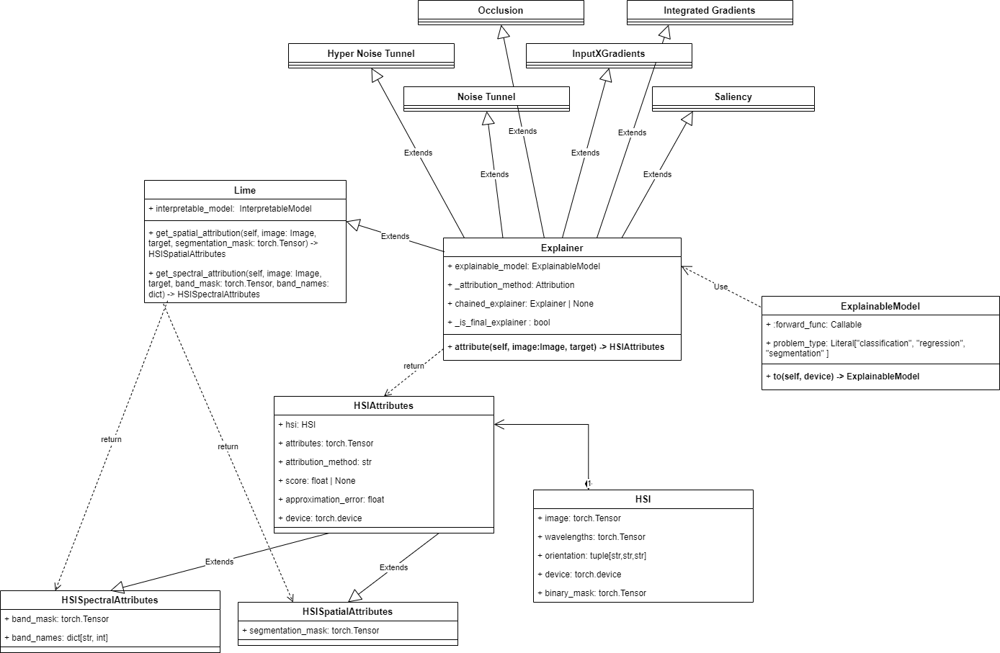

# API Reference

- [API Reference](#api-reference)
    - [Meteors](#meteors)
      - [Attribution Methods](#attribution-methods)
        - [Lime](#lime)
        - [Lime Base](#lime-base)
        - [Integrated Gradients](#integrated-gradients)
        - [InputXGradients](#inputxgradients)
        - [Occlusion](#occlusion)
        - [Saliency](#saliency)
        - [Noise Tunnel](#noise-tunnel)
        - [Hyper Noise Tunnel](#hyper-noise-tunnel)
      - [HyperSpectral Image](#hyperspectral-image)

The architecture of the package can be seen on the UML diagram:

### Attribution Methods

::: src.meteors.hsi.HSI
options:
show_bases: false
show_root_heading: true
show_root_full_path: false

The architecture of the package can be seen on the UML diagram:

## Visualizations

::: src.meteors.visualize.lime_visualize
options:
heading_level: 3
show_bases: false
show_root_heading: true
show_root_full_path: false
members: - "visualize_spectral_attributes_by_waveband" - "visualize_spectral_attributes_by_magnitude" - "visualize_spectral_attributes" - "visualize_spatial_attributes"

## Methods

### LIME

::: src.meteors.lime.HSIAttributes
options:
heading_level: 4
show_bases: false
show_root_heading: true
show_root_full_path: false

::: src.meteors.lime.HSISpatialAttributes
options:
heading_level: 4
show_bases: true
show_root_heading: true
show_root_full_path: false

::: src.meteors.lime.HSISpectralAttributes
options:
heading_level: 4
show_bases: true
show_root_heading: true
show_root_full_path: false

::: src.meteors.lime.Explainer
options:
heading_level: 4
show_bases: false
show_root_heading: true
show_root_full_path: false

::: src.meteors.lime.Lime
options:
heading_level: 4
show_bases: true
show_root_heading: true
show_root_full_path: false

::: src.meteors.attr

This module consists of all the package attribution methods. It is heavily inspired by the `attr` module of the `captum` package but is adapted to the multispectral images.

#### Lime

::: src.meteors.attr.lime

This method is an adapted implementation of Lime, which supports handling multispectral images. This class also provides methods to generate aggregation masks used by the Lime method.

1. _segmentation mask_ - this mask is used in the _spatial_ aggregation. The segmentation mask divides the pixels from the image into superpixels so that the objects and regions on the hyperspectral image might be analyzed as a whole.
2. _band mask_ - the band mask divides the channels into groups of channels that might be relevant for the model. Such groups used for the explanations could be Red, Green and Blue bands.

#### Lime Base

The Lime Base class was adapted from the Captum Lime implementation. This adaptation builds upon the original work, extending and customizing it for specific use cases within this project. To see the original implementation, please refer to the [Captum repository](https://captum.ai/api/_modules/captum/attr/_core/lime.html#LimeBase).

#### Integrated Gradients

::: src.meteors.attr.integrated_gradients

The Integrated Gradients method is based on the [`captum` implementation](https://captum.ai/docs/extension/integrated_gradients) and is an implementation of an idea coming from the [original paper on Integrated Gradients](https://arxiv.org/pdf/1703.01365), where more details about this method can be found.

#### InputXGradients

::: src.meteors.attr.input_x_gradients

The InputXGradients method is a straightforward approach to computing attribution. It simply multiplies the input image with the gradient with respect to the input. This method is based on the [`captum` implementation](https://captum.ai/api/input_x_gradient.html)

#### Occlusion

::: src.meteors.attr.occlusion

This attribution method perturbs the input by replacing the contiguous rectangular region with a given baseline and computing the difference in output. In our case, features are located in multiple regions, and attribution from different hyper-rectangles is averaged.

The implementation of this method is also based on the [`captum` repository](https://captum.ai/api/occlusion.html).

More details about this approach can be found in the [original paper](https://arxiv.org/abs/1311.2901)

#### Saliency

::: src.meteors.attr.saliency

This baseline method for computing input attribution calculates gradients with respect to inputs. It also has an option to return the absolute value of the gradients, which is the default behaviour.

Implementation of this method is based on the [`captum` repository](https://captum.ai/api/saliency.html)

#### Noise Tunnel

::: src.meteors.attr.noise_tunnel

This attribution method works on top of a different one to better approximate its explanations.
The Noise Tunnel (Smooth Grad) adds Gaussian noise to each input in the batch and applies the given attribution algorithm to each modified sample.

This method is based on the [`captum` implementation](https://captum.ai/api/noise_tunnel.html)

#### Hyper Noise Tunnel

::: src.meteors.attr.hyper_noise_tunnel

Hyper Noise Tunnel is our novel method, designed specifically to explain hyperspectral satellite images. It is inspired by the behaviour of the classical Noise Tunnel (Smooth Grad) method, but instead of sampling noise into the original image, it randomly removes some of the bands. In the process, the created _noised_ samples are close to the distribution of the original image yet differ enough to smoothen the produced attribution map.

### HyperSpectral Image

::: src.meteors.hsi

The HyperSpectral Image is a dataclass that stores information about a specific hyperspectral image. It contains all the necessary data for the image to be preprocessed, such as:
 - wavelengths of all the image bands
 - orientation of the image (information on which image axis corresponds to width, height or channel dimension)
 - binary mask - which is the mask of the image that can cover unnecessary regions for the model

Additionally, this class facilitates plotting the images and helps to integrate images into our attribution methods.
